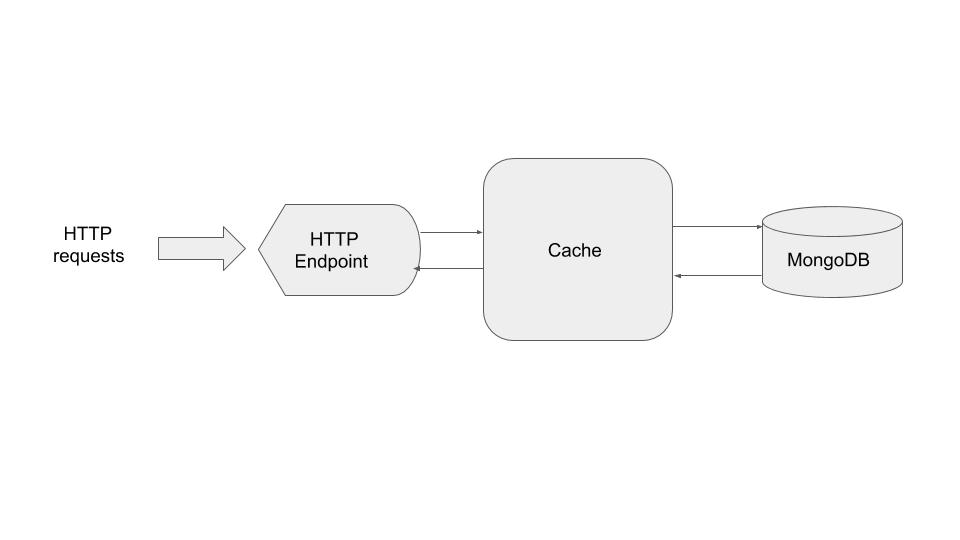

# Toy URL Shortener: Architecture and Control Flow

+ MongoDb runs in a docker container with exposed port 27017.
+ In tests I use *testcontainer* to run MongoDb.

Control flow details:
+ Values are evicted from the cache after 5 seconds.
+ When a new value is introduced into the system, the value is stored in the cache
and is being written through to database right away.
+ When accessing a value that already has been  introduced to the system, I retrieve it from the cache. 
If the value has been cleared from the cache, I retrieve it from the database and store it the cache.
 

# Execution Instructions       

## Setup
1. Create  and start a MongoDB docker container.
2. Run main.go.

## Creating a MongoDB Docker Container Step By Step 
+ Create docker file:
```
FROM debian:jessie-slim
RUN apt-get update && \
apt-get install -y ca-certificates && \
rm -rf /var/lib/apt/lists/*
RUN gpg --keyserver ha.pool.sks-keyservers.net --recv-keys 0C49F3730359A14518585931BC711F9BA15703C6 && \
gpg --export $GPG_KEYS > /etc/apt/trusted.gpg.d/mongodb.gpg
ARG MONGO_PACKAGE=mongodb-org
ARG MONGO_REPO=repo.mongodb.org
ENV MONGO_PACKAGE=${MONGO_PACKAGE} MONGO_REPO=${MONGO_REPO}
ENV MONGO_MAJOR 3.4
ENV MONGO_VERSION 3.4.18
RUN echo "deb http://$MONGO_REPO/apt/debian jessie/${MONGO_PACKAGE%-unstable}/$MONGO_MAJOR main" | tee "/etc/apt/sources.list.d/${MONGO_PACKAGE%-unstable}.list"
RUN echo "/etc/apt/sources.list.d/${MONGO_PACKAGE%-unstable}.list"
RUN apt-get update
RUN apt-get install -y ${MONGO_PACKAGE}=$MONGO_VERSION
VOLUME ["/data/db"]
WORKDIR /data
EXPOSE 27017
CMD ["mongod", "--smallfiles"]
```
+ Build image: ```docker build -t hello-mongo:latest .```
+ Start container with the built image: 
```docker run --name my-mongo1 -d -v /tmp/mongodb:/data/db -p 27017:27017 hello-mongo```
+Access table in the mongo container:
```
docker exec -it mongodb-container-id /bin/bash
mongo test
show dbs
use my-mongo1
show collections
db.urlhash.find()
```

## Run the Docker Container and Main
+ docker run --name my-mongo1 -d -v /tmp/mongodb:/data/db -p 27017:27017 hello-mongo
+ or restart already existing mongo-db docker
+ go run main.go
+Run http://localhost:8090/shorten?url=ynet.co.il
+Run http://localhost:8090/redirect?hash=eW5ldC5jby5pbA== (I did not manage to actually perform http redirect).

# Various 
[Test Containers in GoLang Tutorial](https://github.com/testcontainers/testcontainers-go)

[Overview of methods to shortening an URL](https://stackoverflow.com/questions/742013/how-do-i-create-a-url-shortener)

